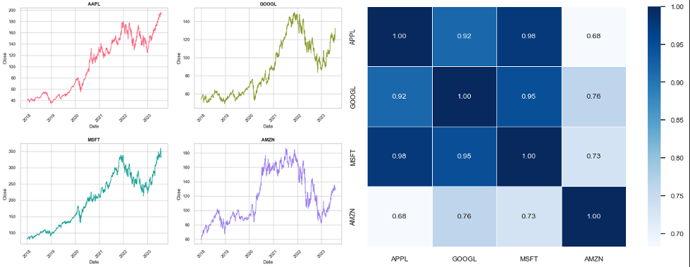

# Portfolio

---

## Single-cell RNA Sequencing Analysis

### Project Overview

This project explores the detailed dynamics of cellular differentiation and maturation using single-cell RNA sequencing (scRNA-seq) techniques. It covers extensive data wrangling, exploratory data analysis, and predictive modeling to investigate the gene-protein interactions as bone marrow stem cells evolve into mature blood cells. The complete analysis pipeline is documented across multiple Jupyter notebooks, each focusing on a crucial aspect of the data science workflow.

### [View on GitHub](https://github.com/MJTGhasemi/ScRNA-Sequencing)

### Key Components

#### Data Wrangling
The data wrangling process involved comprehensive data cleaning, integration, and transformation of single-cell genomic data from bone marrow stem cells. This step was crucial for preparing the dataset for in-depth exploratory data analysis and subsequent modeling.

**Notebook:** [ScRNA Sequencing_Data Wrangling.ipynb](https://github.com/MJTGhasemi/ScRNA-Sequencing)

#### Exploratory Data Analysis (EDA)
A thorough EDA was conducted to identify significant patterns, outliers, and relationships within the data. This included univariate, bivariate, and multivariate analyses, utilizing visualization techniques such as heatmaps, violin plots, and scatter plots.

**Notebook:** [ScRNA Sequencing_EDA.ipynb](https://github.com/MJTGhasemi/ScRNA-Sequencing)

#### Preprocessing and Predictive Modeling
Various machine learning models were developed to predict gene-protein interactions, focusing on model performance and robustness. This phase involved feature engineering, model selection, and extensive evaluation.

**Notebook:** [ScRNA Sequencing_Preprocessing_Modeling.ipynb](https://github.com/MJTGhasemi/ScRNA-Sequencing)

### Final Report
The final report compiles all findings and insights, providing a detailed discussion of the methodologies used, key results, implications for future research, and potential practical applications.

**PDF Report:** [ScRNA Sequencing Final Report](https://github.com/MJTGhasemi/ScRNA-Sequencing/ScRNA_Sequencing_Final_Report.pdf)

### Key Findings
- Identification of critical gene-protein relationships essential for understanding cellular maturation.
- Development of predictive models to forecast cellular differentiation trajectories.
- Insights into potential therapeutic targets and diagnostic markers.

### Technologies Used
- Python
- Jupyter
- Libraries: Pandas, Numpy, Matplotlib, Scikit-Learn, LightGBM

### Implications
The project offers profound insights into cellular biology and provides a foundation for advanced therapeutic strategies and disease understanding, highlighting the importance of integrating computational methods with biological research.

---

## Stock Price EDA and Analysis (Time Series)

An Exploratory Data Analysis (EDA) and Time Series Analysis have been conducted on stock prices. The data is fetched for four companies: `Apple`, `Google`, `Microsoft`, and `Amazon` from **2018-01-01** to **2023-07-31** using **Yahoo Finance**. By the end of this notebook, we hope to have extracted meaningful insights from our data and built a reliable time series model that can predict future stock prices.

- The stock data is visualized using line plots and bar plots. These visualizations include volume over time for each company, daily price change, monthly and yearly average closing prices for Apple, pairplots, heatmaps of closing prices and daily returns for all companies, and more.

- The closing prices are transformed to their logarithmic form to stabilize the variance. The data is split into training and testing sets in a chronological manner.

- The Augmented Dickey-Fuller (ADF) test is performed on the training data to check for stationarity. The rolling mean and standard deviation are also plotted.

- Autocorrelation and partial autocorrelation plots are generated for the differences in the closing prices.

- An ARIMA model fits the training data using the auto_arima function, which automatically determines the model's best parameters (p, d, q).

- The trained model is used to forecast the closing prices for the test set. The forecasts are plotted alongside the actual values. The residuals of the model are also plotted, and their statistics are displayed. Root Mean Square Error (RMSE) and Mean Absolute Percentage Error (MAPE) are calculated to evaluate the performance of the model.

